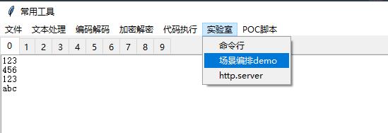

# pyoneGUI

**重要：** 请在issues中完善反馈意见，尤其是不需要大的环境依赖就能实现的有意思的功能点。

# 环境依赖
```
这些版本下有效，其他版本未测试（2024.1.2更新）
1.Win10下正常，Win7下报错
Python: 3.12.0 (tags/v3.12.0:0fb18b0, Oct  2 2023, 13:03:39) [MSC v.1935 64 bit (AMD64)]
tkinter.TkVersion: 8.6
pyinstaller: 6.2.0

2.Win10下正常，Win7_64位下正常
Python: 3.7.3 (v3.7.3:ef4ec6ed12, Mar 25 2019, 21:26:53) [MSC v.1916 32 bit (Intel)]
tkinter.TkVersion: 8.6
pyinstaller: 5.13.2

```

# 打包说明
```bash
打包出来的程序会有命令行窗口，其实留着命令行窗口也挺好，方便看报错日志。
pyinstaller -F main.py --noupx

把py脚本后缀改为pyw，再打包，运行时就没有命令行窗口了。
pyinstaller -F main.pyw --noupx

```

对于打包好的程序，使用"代码执行->执行Python代码"功能执行如下代码，可以查看打包到pyoneGUI里的依赖库等信息
```python
查看python版本
import sys
print(sys.version)

查看操作系统版本
import platform
print(platform.platform())

查看依赖库信息
import sys
for module_name in sys.modules:
    print(module_name)

查看requests库的信息
import requests
print(requests.__version__)

```

# 特点介绍
## 绿色便携
这个特点是pyinstaller带来的，将程序和依赖库打包成一个可执行文件，绿色便携，路径无关，方便执行。

## 插件自由
这个特点是由exec函数配合技巧性的软件设计带来的。核心逻辑如下：
```python
lst_py=[]
def traverse_directory(path):
    for entry in os.scandir(path):
        if entry.is_file():
            if entry.path.endswith(".py"):
                if entry.name=="base.py":
                    lst_py.insert(0, entry.path)
                else:
                    lst_py.append(entry.path)
        elif entry.is_dir():
            traverse_directory(entry.path)

traverse_directory("plugin")
for path in lst_py:
    code=read_file(path)
    exec(code)

lst_plugin=[obj for obj in [v() for v in globals().values()  if Plugin in getattr(v, "__mro__", [])] if obj.__class__.__name__!="Plugin" ]

```

## 即改即用
这个特点是Python本身的能力。

有这个能力加持，如果对某个插件不满意，可以即改即用，比如GBK解码报错，可以立即换成别的编码，甚至更改整个函数逻辑，使用的就是熟悉的Python语言，不需要增加新的学习成本，灵活且强大，除了性能和稳定性，没有槽点。（非常适合写小工具和实验性质的项目，比如PoC）

## 几乎可以完美表现Python的能力
这个特点是exec函数带来的


# 插件举例
每个插件都是Plugin类的子类，只要在plugin目录下随便建一个py文件写个Plugin子类就是一个新的插件。需要注意的是，每个插件类的类名是唯一的，不能重复，否则会丢失之前定义的插件。

插件机制的代码逻辑可参见“插件自由”特点介绍、main.py、plugin/base.py等内容。

## 字典去重
“字典去重”这个插件是在demo.py中实现的，其类名为RemoveDuplicates（唯一），menu和name分别是菜单名称和插件名称，这两个值决定了插件的显示名称。
```python
class RemoveDuplicates(Plugin):
    menu="文本处理"
    name="字典去重"
    def run(self, text):
        if not text:
            return ""
        words = text.strip().replace("\r\n", "\n").split("\n")
        return "\n".join(list(dict.fromkeys(words)))
```


## json格式化
“json格式化”这个插件是在demo.py中实现的
```python
class JsonView(Plugin):
    menu="文本处理"
    name="json格式化"
    def run(self, text):
        if not text:
            return ""
        j=json.loads(text)
        #formatted_json = json.dumps(j, indent=4)
        formatted_json = json.dumps(j, indent=4, ensure_ascii=False)
        return formatted_json
```

## 场景编排demo
“场景编排demo”这个插件是在laboratory.py中实现的，这是一个实验性质的插件，其展示了场景编排能力，可以把其他的插件组合在一起，按照新的逻辑处理任务。
```python
class WorkflowOrchestration(Plugin):
    menu="实验室"
    name="场景编排demo"
    type="text"
    def run(self, text):
        tasks=[]
        tasks+=[RemoveDuplicates]
        tasks+=[ToLower]
        tasks+=[SortLines]
        
        for _ in tasks:
            text=_().run(text)
        
        return text
```



## 命令行
“命令行”这个插件是在laboratory.py中实现的，可以执行系统命令。这是一个有自定义界面的插件，其type类型为laboratory，通过buildWindow函数绘制了插件界面，并返回了self.output_text，点击“开始”的时候执行onStart函数，点击“查看帮助文档”的时候执行showHelp函数。
```python
class CMD(Plugin):
    menu="实验室"
    name="命令行"
    type="laboratory"
    def buildWindow(self):
        tab_laboratory = self.frame_args["tab_laboratory"]
        此处省略一些花界面的代码

        # 设置options
        self.options=Options()
        dic={"Name":"CMD", "Current Setting":"", "Required":"yes", "Description":"执行的命令", "obj":cmd_entry }
        self.options.append(dic)
        return self.output_text
        
    def onStart(self, event=None):
        options=self.getOptions()
        cmd=options["CMD"]
        
        self.log(f"[+] {cmd}\n")
        self.executeCommand(cmd, logfunc=self.log)
        # TODO：添加自定义命令，并使自定义命令和系统命令都支持管道

    def onStop(self, event=None):
        self.log("[*] onStop\n")
            
    def showHelp(self, event=None):
        super().showHelp()
        help="功能上相当于system(CMD)\n\n"\
             "Windows下常用命令：\n"\
             "netstat -ano | findstr LISTEN\t\t\t查看监听端口\n"\
             "\n"
        self.log(help)
```


## http.server
“http.server”这个插件是在laboratory.py中实现的，点击开始按钮会启动一个简单的HTTP服务，可以用来下载文件。
```python
class HttpServer(Plugin):
    menu="实验室"
    name="http.server"
    type="laboratory"
    server=None
    def buildWindow(self):
        tab_laboratory = self.frame_args["tab_laboratory"]
        此处省略一些花界面的代码

        # 设置options
        self.options=Options()
        dic={"Name":"IP", "Current Setting":"", "Required":"yes", "Description":"监听网卡的IP", "obj":ip_entry }
        self.options.append(dic)
        dic={"Name":"PORT", "Current Setting":"", "Required":"yes", "Description":"监听端口", "obj":port_entry }
        self.options.append(dic)
        
        #MyHandler里会用
        PluginGlobalStorage[self.__class__.__name__]={"class_obj":self}
        return self.output_text
        
    def onStart(self, event=None):
        options=self.getOptions()
        IP=options["IP"]
        PORT=int(options["PORT"])
        
        class MyHandler(http.server.SimpleHTTPRequestHandler):
            def log_message(self, format, *args):
                msg=format%args
                obj=PluginGlobalStorage["HttpServer"]["class_obj"]
                obj.log(msg+"\n")
                
        def fn():
            with socketserver.TCPServer((IP, PORT), MyHandler) as self.server:
                self.log(f"监听于{IP}:{PORT}\n")
                self.server.serve_forever()
                
        self.log("[+] 启动Server\n")
        thread = threading.Thread(target=fn)
        thread.start()

    def onStop(self, event=None):
        if self.server:
            self.log("[+] 关闭Server\n")
            self.server.shutdown()
            self.server=None
        else:
            self.log("[*] Server未启动\n")
            
    def showHelp(self, event=None):
        super().showHelp()
        self.log("相当于在python3下调用：\n")
        self.log("python -m http.server port\n\n")
        self.log("或者相当于在python2.7下调用：\n")
        self.log("python -m SimpleHTTPServer port\n\n")
```


## HTTP访问
"HTTP访问"这个插件是在poc.py中实现的，可以访问指定的URL地址并返回结果，是PoC功能的一个例子。这个插件没有定义buildWindow函数，而是使用的父类Plugin默认的buildWindow函数完成的界面绘制。
```python
class HttpGet(Plugin):
    menu="POC脚本"
    name="HTTP访问"
    type="laboratory"
    def onStart(self, event=None):
        options=self.getOptions()
        try:
            res = requests.get(options["URL"], headers=self.headers, timeout=3, verify=False)
            if 200==res.status_code:
                self.log(res.content.decode("utf-8"))
        except Exception as e:
            print(e)
```


# 下一步计划
```
1.接收合理的反馈意见，完善现有框架结构
2.寻找有趣的点，丰富插件功能
3.尝试Linux环境下打包，并能够在支持图形操作的同时支持命令行操作
```
